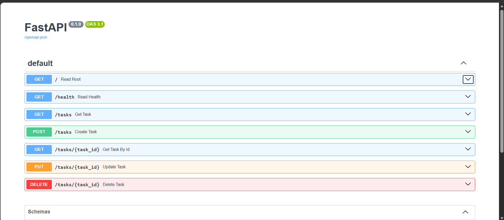

# Task API — CRUD Backend

A small REST API built with **FastAPI** (Python) that manages a to-do list of tasks — supporting full **Create, Read, Update, Delete (CRUD)** operations. Task data is stored in memory (no database), and the API is documented and testable through the built-in Swagger UI.

Built as part of the FlyRank Internship — Backend Track, Week 2, Assignment A1.

---

## How to Install & Run

**Requirements:** Python 3.10+

1. Install dependencies:
   ```
   pip install fastapi uvicorn
   ```

2. Run the server:
   ```
   python -m uvicorn main:app --reload
   ```

3. The API will be available at:
   - `http://127.0.0.1:8000` — the API itself
   - `http://127.0.0.1:8000/docs` — interactive Swagger UI documentation

---

## Endpoints

| Method | Path | Description | Success Code |
|--------|------|-------------|---------------|
| GET | `/` | API info (name, version, available endpoints) | 200 |
| GET | `/health` | Health check | 200 |
| GET | `/tasks` | List all tasks | 200 |
| GET | `/tasks/{task_id}` | Get a single task by id | 200 (404 if not found) |
| POST | `/tasks` | Create a new task | 201 (400 if title is empty) |
| PUT | `/tasks/{task_id}` | Update a task's title and/or done status | 200 (404 if not found, 400 if title invalid) |
| DELETE | `/tasks/{task_id}` | Delete a task | 204 (404 if not found) |

---

## Example Request (curl)

**Create a new task:**
```
curl -i -X POST http://127.0.0.1:8000/tasks -H "Content-Type: application/json" -d "{\"title\":\"Buy milk\"}"
```

**Response:**
```
HTTP/1.1 201 Created
content-type: application/json

{"id":4,"title":"Buy milk","done":false}
```

**Get task by id, returning 404 for an unknown id:**
```
curl -i http://127.0.0.1:8000/tasks/99
```

**Response:**
```
HTTP/1.1 404 Not Found
content-type: application/json

{"detail":"Task 99 not found"}
```

---

## Swagger UI

All endpoints are documented and testable at `/docs`, including a live "Try it out" feature for every route.



*(Screenshot: full endpoint list in Swagger UI, showing GET /, GET /health, GET /tasks, POST /tasks, GET /tasks/{task_id}, PUT /tasks/{task_id}, DELETE /tasks/{task_id})*

---

## Notes

- Task data is stored **in memory** — restarting the server resets it back to the 3 seed tasks.
- Task ids are never reused, even after deletion — the next id is always calculated as (current highest id) + 1, to avoid id collisions.
- Validation: creating or updating a task with an empty/whitespace-only title returns a `400 Bad Request`.
